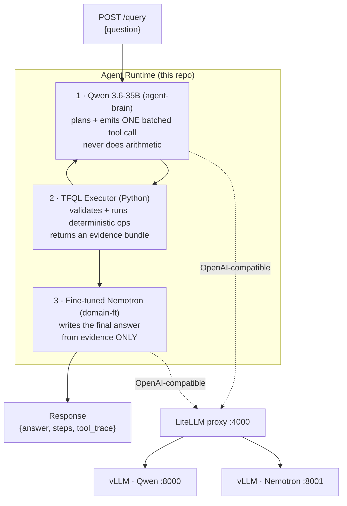
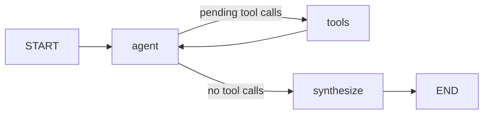
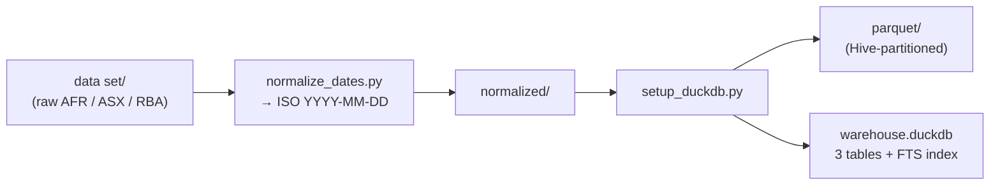
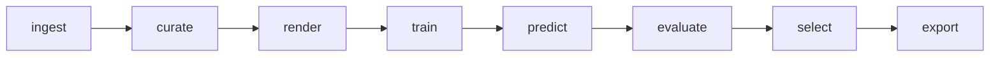

# Wombots — Architecture, Fine-Tuning & Design Decisions

*A financial question-answering agent for the AI Industry Training Hackathon.*

> **Branch documented:** `wombots-dev`
> **One line:** A three-model agent (Qwen plans → deterministic Python computes → fine-tuned Nemotron writes) that answers exact-value financial questions over RBA, ASX, and AFR data inside a 60-second budget.

---

## Table of Contents

1. [The Problem We Were Solving](#1-the-problem-we-were-solving)
2. [System Architecture](#2-system-architecture)
3. [Request Lifecycle](#3-request-lifecycle)
4. [TFQL — The Core Engine](#4-tfql--the-core-engine)
5. [The Data Layer](#5-the-data-layer)
6. [The Fine-Tuning Pipeline](#6-the-fine-tuning-pipeline)
7. [Key Decisions & Their Rationale](#7-key-decisions--their-rationale)
8. [Challenges & How We Solved Them](#8-challenges--how-we-solved-them)
9. [Results & Current Status](#9-results--current-status)
10. [Repository Map](#10-repository-map)

---

## 1. The Problem We Were Solving

The hackathon asks for an agent that answers **hidden financial questions** over three fixed Australian datasets, and grades it on three pillars:

| Category | Weight | What it rewards |
|---|---:|---|
| Fine-tuned model quality | 30% | A real fine-tune, base-vs-tuned improvement, evidence |
| Architecture & repo quality | 30% | Design, tooling, reproducibility, documentation |
| Hidden-question correctness | 40% | **Component-based partial credit + response-time penalties** |

Two constraints dominate everything that follows:

- **The 60-second cliff.** `≤60s` = full points · `60–300s` = 20% penalty · `>300s` = **zero**.
- **Concurrency.** At least **3 simultaneous `/query` requests** must be served without corrupting shared state.

The three datasets:

| Dataset | Contents | Size |
|---|---|---|
| **RBA** | Reserve Bank cash-rate decisions | 175 records (2010–2026) |
| **ASX** | Daily OHLCV prices, 18 companies | ~31.5k rows (2015–2021) |
| **AFR** | Australian Financial Review articles | ~219.5k articles |

> **The thesis of the whole build:** every non-obvious decision is the *scoring rubric turned into code*. The cliff makes the number of model round-trips the thing to minimise; exact grading makes "never let an LLM do arithmetic" non-negotiable.

---

## 2. System Architecture

The hackathon **mandates** a three-model division of labour. This is a contract we implemented, not a shape we chose:



| Model | Role | Fine-tuned? |
|---|---|---|
| **Qwen 3.6-35B** ("brain") | Plans the answer, selects & emits tool calls. Forbidden from arithmetic. | No (supplied) |
| **Agent runtime** (our code) | Validates and executes tool calls against approved data. **All correctness engineering lives here.** | — |
| **Fine-tuned Nemotron** | Synthesises the natural-language `answer` from verified tool results. | **Yes (our 30%)** |

**Wiring notes**
- Everything talks to an **org-managed LiteLLM proxy** using OpenAI-compatible calls. Model *aliases* (`agent-brain`, `domain-ft`) route to vLLM backends; the code never touches vLLM ports directly (`src/llm/client.py`).
- **Serving stack:** async **FastAPI** + **LangGraph** state machine; a single async worker with an `asyncio.Semaphore` handles ≥3 concurrent queries.
- **`/health` is readiness, not liveness** — it stays `503` until the warehouse is fully loaded, because the harness starts firing questions the instant it sees `200`.

---

## 3. Request Lifecycle

Implemented as a **LangGraph** state machine (`src/graph/workflow.py`):



1. **`agent`** — calls Qwen with the planner system prompt + question, exposing exactly one tool, `execute_plan`. Qwen returns a *batched* plan of operations.
2. **`tools`** — executes the plan (parallel via `asyncio.gather`), appends structured results as `tool` messages, records a `tool_trace`.
3. **Loop** back to `agent` for **at most one repair turn** (prompt: make at most one further call, only for a genuinely missing component). Hard bound: `MAX_AGENT_STEPS = 5`.
4. **`synthesize`** — fine-tuned Nemotron writes the final one-or-two-sentence `answer` from the evidence bundle.

Only `answer` is graded; `steps` and `tool_trace` are kept for diagnostics.

---

## 4. TFQL — The Core Engine

**TFQL = "Typed Financial Query Language."** Instead of giving Qwen raw SQL or generic query tools, we built a **closed vocabulary of typed, question-shaped operations**. This is the central intellectual contribution of the project.

```
question
  → Qwen planner        emits one execute_plan envelope
  → TFQL validator      whole plan checked before anything runs
  → TFQL executor       deterministic ops, in dependency order
  → evidence bundle     computed values + method + coverage + warnings
  → fine-tuned Nemotron writes the final answer from the bundle alone
```

### 4.1 Why It Exists — Three Converging Forces

1. **Latency makes tool-call *count* the dominant cost.** Data work is microseconds; the expensive thing is the round-trip to Qwen. **Batching every independent operation into one envelope** is the only real lever. A one-tool-per-metric design would need 3–4 turns for cross-dataset questions and blow the budget.
2. **The judge checks exact values; LLMs produce plausible ones.** Two of the brief's three zero-score examples were arithmetic/composition failures; a partial-credit example lost half its marks over a **one-day date error**. So arithmetic must never touch the LLM.
3. **Fine-tuning needs a stable input contract.** The evidence bundle *is* the training input format, pinned by `SCHEMA_VERSION`.

### 4.2 Design Rules (enforced structurally, not by prompting)

- **One op answers one *question shape*, not one primitive** — `rba.longest_hold`, not "min of a column."
- **Return every component the shape is graded on** — `rba.rate_extreme` returns the rate *and* first effective date *and* record count, because the worked example lost 50% on the date.
- **Every number ships in the unit the answer will state** — `return_pct` sits beside `return_decimal` so the synthesiser never multiplies. *"Any conversion left undone is one the model will attempt."*
- **Business rules live inside the op** — AFR field scope, ASX trading-day alignment — not arguments Qwen can get wrong.
- **Coverage & method always reported** — cross-dataset gaps are *stated*, never silently spanned.
- **A failed operation never fails the plan** — partial credit is in the rubric, so 3 good results + 1 error beats nothing.

### 4.3 Module Map

| Module | Role |
|---|---|
| `registry.py` | The closed operation vocabulary + auto-generated planner catalogue. `extra="forbid"` → hallucinated args rejected at validation as `UNKNOWN_ARGUMENT`. |
| `models.py` | Plan envelope (`PlanRequest`) + result contract. `MAX_OPERATIONS=6`, `MAX_DEPENDENCY_DEPTH=2`. |
| `executor.py` | **Validate the whole plan before running any of it**; topological sort of `${id.path}` dependencies; partial-failure semantics. |
| `store.py` | Read-only DuckDB warehouse; startup precompute of RBA/ASX into NumPy arrays. |
| `precision.py` | Rates as **integer basis points**; percent conversion only at the output boundary. |
| `dates.py` | The `previous \| next \| nearest \| exact` predecessor/successor lookup — the most reused primitive. |
| `coverage.py` | Per-dataset intervals, clamping, cross-dataset overlap. |
| `evidence.py` | The bundle handed to the synthesiser — values + method + coverage + warnings. |
| `invariants.py` | Financial identity checks (cycle changes must sum to net move; a drawdown's trough must follow its peak). |
| `errors.py` | Structured error codes — *nothing ever substitutes a plausible value for a failure*. |
| `operations/` | The four operation boxes: `rba`, `asx`, `afr`, `cross`. |

### 4.4 Operation Catalogue

| Dataset | Operations |
|---|---|
| **RBA** | `rate_extreme` · `rate_at_date` · `change_summary` · `longest_hold` · `rate_cycle` · `period_comparison` |
| **ASX** | `return` · `price_extreme` · `biggest_move` · `max_drawdown` · `rank_returns` · `volume_rank` · `event_window` · `equal_weight_basket` · `summary_stat` |
| **AFR** | `pattern_count` · `retrieve_articles` · `date_count` |
| **Cross** | `rate_event_market_return` · `news_rate_context` |

Anything spanning datasets that isn't a named op uses `depends_on` + `${peak.data.date}` references resolved at execution time — no new op needed.

### 4.5 Correctness Techniques Worth Highlighting

- **Basis points, not floats.** `0.1 + 0.25 != 0.35` in binary FP, so rate arithmetic is integer; `cash_rate_target == 0.1` equality (used to count records at an extreme rate) is exact by construction. Prices stay `float64` but round only at output.
- **"Changes" vs. "records."** The RBA emits monthly rows with `change=0`. "Held unchanged" means the gap between consecutive *changes*, not *records* — conflating them was the brief's zero-score Example 2. Encoded once in `_qualifying()`.
- **AFR four-field rule.** Pattern counts search `HEADLINE + SUBHEAD + INTRO + TEXT` combined (one `AFR_ALL_TEXT` SQL expression), case-insensitive, whole-word `\b`-anchored, **once per record**. **Counting never touches the FTS index** (it stems `bank→banking` and omits `intro`); the index is for *retrieval* only.
- **Evidence-as-contract.** Each op returns *how* a value was obtained (method, records used, coverage, warnings). The synthesiser writes only from the bundle, so "no unsupported claims" is enforced by construction — the model has nothing else to draw on.

---

## 5. The Data Layer

Turns the raw `data set/` (tracked in git) into a queryable warehouse:



**Design choices**
- **DuckDB + Parquet** for fast columnar reads; **Hive partitioning** (`ticker` for ASX, `year`/`month` for AFR) keeps queries fast as file counts grow.
- **Defensive ingest** — AFR rows with empty `PUBLICATIONDATE` dropped (92 of ~219.5k); `volume` uses `TRY_CAST` (a past BHP corruption motivated it).
- **DuckDB FTS index** on AFR for ranked BM25 retrieval — but never for counting.
- **`test_queries.py`** re-derives known facts via SQL and asserts them, catching ingestion regressions, not just crashes.
- **Concurrency** — `Store.query()` uses `con.cursor()` for an independent cursor per request (DuckDB connections aren't thread-safe to share).

**In-memory strategy:** RBA (175 rows) and ASX (~31.5k) load **entirely into memory as NumPy arrays at startup** (every numeric op is then array work, no DB round-trip); AFR stays in DuckDB for its vectorised text scan. The built `Store` is **immutable** → safe to share across concurrent requests lock-free.

---

## 6. The Fine-Tuning Pipeline

A **staged, contract-agnostic LoRA pipeline** (`training/ft-pipeline/`). Guiding idea: build and test the parts that *are* decided (LoRA, checkpoint selection, splitting, evidence) *before* the parts that aren't (exact prompt format, grading contract).

### 6.1 The Eight Stages (file-in / file-out, each re-runnable alone)



| Stage | In → Out | Decides |
|---|---|---|
| `ingest` | raw → `canonical.jsonl` | which source adapter |
| `curate` | canonical → train/val/test | dedupe, **group-aware** split |
| `render` | canonical → messages + length report | prompt format, seq-len budget |
| `train` | messages → LoRA checkpoints | backend, hyperparameters |
| `predict` | base **and** every checkpoint → predictions | decoding |
| `evaluate` | predictions × graders → metrics | what "good" means |
| `select` | metrics → chosen checkpoint + rationale | shipping policy |
| `export` | → evidence bundle | packaging |

> `predict` (slow, GPU) is deliberately **split** from `evaluate` (fast, CPU) so grader definitions can churn without re-running training.

### 6.2 Three Deliberate Design Choices

- **One prompt builder** — `renderers/chat.py::build_messages` builds *both* training text and live serving requests, making train/serve prompt skew (*"trained fine, worse in production"*) structurally impossible. A test fails if prompt-format knowledge ever leaks outside `renderers/`.
- **Group-aware splitting** — `curate` splits on `meta.group_key`, never on rows, so near-duplicate template families can't straddle train/val and produce a fictional val score.
- **Guardrailed selection** — `select` maximises `component_recall` *subject to* guardrails (`hallucinated_number_rate ≤ 0.05`, `preamble_rate ≤ 0.10`), so a checkpoint that scores higher by inventing numbers can't win. Prefers the earliest checkpoint within a tie tolerance.

### 6.3 Model & Method

| Setting | Value | Note |
|---|---|---|
| Method | **LoRA** (+ DoRA, rsLoRA, optional NEFTune) | Base weights frozen, ~tens-of-MB adapter; all config-driven |
| Target model | `nvidia/Llama-3.1-Nemotron-Nano-8B-v1` | The hackathon model, ~16 GB bf16 |
| Iteration model | `unsloth/Llama-3.2-3B-Instruct` | Same architecture/chat template, ~6 GB; `train.model_id` is the only line that changes |
| Hardware | GB10 (Blackwell), CUDA 13.0 | torch-first CUDA-index install documented |
| LoRA config | rank 32, alpha 64, dropout 0.05, `all-linear` | organiser reference baseline |
| Optim | 100 steps, lr 5e-5, cosine, grad-accum 8 | `lr 1e-4` documented to spike after warmup |

**Undecided config values are `null`, not defaults** — `config.require()` raises `UndecidedError` naming the exact key rather than guessing. `train.seq_len` is deliberately strict (must come from `render`'s measured p95 length, since guessing is where OOM risk lives).

### 6.4 Training Data — Grounded, Never Guessed

`src/data/generate_training_data.py` produces fine-tune data by **actually running TFQL `execute_plan` against the real warehouse** — never by asking an LLM to invent a number (126 rows, 29 template families). Three grounded categories:

| Category | Behaviour |
|---|---|
| **answerable** | Plan succeeds; answer states exactly the returned fields. |
| **unanswerable** | Real `TFQLError` raised (coverage gap / unknown ticker / out-of-range date); refusal cites *actual* coverage bounds. |
| **extrapolation** | Forecast framing; grounds on the last real observation, then explicitly declines to invent. |

Each record carries `answer`, `steps`, `tool_trace`, and component-based `grading` metadata — so the file doubles as fine-tune input and calibration cases.

---

## 7. Key Decisions & Their Rationale

### 7.1 ⭐ Disable Qwen's reasoning tokens — the single highest-leverage finding

```python
extra_body = {"chat_template_kwargs": {"enable_thinking": False}}
```

| Mode | Planner latency | Tokens | Plan quality |
|---|---|---|---|
| thinking **on** (vLLM default) | **83–92 s** | 1726 | correct |
| thinking **off** | **5.4 s** | 110 | **identical** |

Qwen3 emits a chain-of-thought by default. On a two-operation plan that alone costs ~83s — **breaching the 60s cliff before any data is touched.** The insight: the TFQL catalogue already constrains the output space, so the planner only *selects* operations; it never needs to reason about arithmetic. **15× faster for identical output.**

### 7.2 Batch everything into one `execute_plan` call

The expensive thing is the model round-trip, not the data work. Packing every independent operation into one envelope — with `${id.path}` references for dependencies — means cross-dataset questions resolve in a single planner pass instead of 3–4 turns.

### 7.3 Never let an LLM do arithmetic

All math happens in deterministic Python: integer basis points for rates, precomputed NumPy arrays for prices, financial-invariant checks that turn a wrong number into an error. The models only *plan* and *transcribe*.

### 7.4 Partial failure ≠ request failure

The rubric gives partial credit, so a failed operation degrades into a stated limitation in the evidence bundle rather than collapsing the whole answer. Three correct components out of four still score.

### 7.5 Readiness gating on `/health`

The harness treats `200` as "start sending questions." So `/health` stays `503` until the warehouse is warm — all expensive startup work runs in the FastAPI `lifespan` handler, where no clock is running.

### 7.6 Auto-generated tool catalogue

Qwen's single tool description is generated from the live TFQL registry + loaded store, so the prompt can never advertise a nonexistent operation, and the ticker list / coverage dates are always accurate — saving a discovery round-trip the budget can't afford.

---

## 8. Challenges & How We Solved Them

| Challenge | Symptom | Solution |
|---|---|---|
| **The 60s cliff** | A single planning call took 83s+ with reasoning on | Disable `enable_thinking`; batch all ops into one call |
| **LLMs produce plausible-but-wrong numbers** | Zero-score examples in the brief were arithmetic failures | TFQL: closed, typed, deterministic operations; models never compute |
| **One-day date errors cost half marks** | Predecessor/successor ambiguity ("rate in effect on date") | A single tested `previous\|next\|nearest\|exact` lookup reused everywhere |
| **Float rate arithmetic drifts** | `0.1 + 0.25 != 0.35`; equality tests unsafe | Rates as integer basis points end-to-end; convert only at output |
| **"Changes" vs "records"** | RBA emits monthly `change=0` rows; naïve gap counts wrong | `_qualifying()` distinguishes decision *changes* from *records* |
| **AFR counting rules** | Wrong field scope / FTS stemming inflates counts | Four-field `AFR_ALL_TEXT`, whole-word, once per record; FTS for retrieval only |
| **≥3 concurrent requests** | Shared DuckDB connection / state corruption | Immutable in-memory store; per-request cursors; async + semaphore; CPU work offloaded to threads |
| **Train/serve prompt skew** | "Trained fine, worse in production" | One shared prompt builder for training and serving; a test enforces it |
| **Fictional val scores** | Near-duplicate templates leak across splits | Group-aware splitting on `meta.group_key` |
| **Checkpoints that "win" by hallucinating** | Higher score, invented numbers | Guardrailed selection with `hallucinated_number_rate` ceiling |
| **Building before the contract is final** | Prompt format / grading schema undecided | Contract-agnostic staged pipeline; undecided keys are `null` and fail loudly |
| **Blackwell/CUDA 13 GPU quirks** | `bf16/gpu` ValueError actually meaning "no GPU visible" | torch-first CUDA-index install; documented device-map and OOM gotchas |

---

## 9. Results & Current Status

**Unit level (TFQL):** matches all of the brief's worked examples (lowest rate, longest hold, tightening cycle, highest rate).

**End-to-end through the real model** (full pipeline, 4 worked examples):

| Case | Latency | Ops | Components |
|---|---|---|---|
| easy — lowest rate | 6.3 s | 1 | 3/3 |
| medium — longest hold | 6.1 s | 1 | 5/5 |
| hard — tightening cycle | 7.5 s | 1 | 4/4 |
| cross — BHP peak + rate that day | 10.1 s | 2 | 3/3 |

**15/15 components**, all inside 60s; 3 concurrent questions in 8.1s wall clock. The planner batched into a single call every time and resolved a cross-dataset `${peak.data.date}` reference unaided.

**Broader eval (22 questions, `src/eval/results.md`):**

- **59.6 / 82 components (72.7%)** · 10/22 perfect · mean latency 17.0s · one >60s outlier.
- Misses cluster on multi-op cross-dataset questions where the plan didn't request every needed component — the honest current weak spot.

### Known Limitations (documented, not hidden)

1. Mock RBA data is a day off from the real series (affects one worked example's date).
2. `AFR_ALL_TEXT` is computed per-query (read-only warehouse); should be materialised at ingest on the real ~200k corpus.
3. Mock coverage is narrow (4 tickers vs 18; AFR ~12 weeks) — cross-dataset behaviour under-exercised.
4. `intro` empty in all mock AFR records — four-field rule not validated end-to-end there.
5. Operations run sequentially (deliberate: µs of data work vs seconds of model calls).
6. Per-operation `OPERATION_TIMEOUT` defined but unused.

---

## 10. Repository Map

```
config.yaml, .env.example         # server + LiteLLM/model wiring
requirements.txt, environment.yml # fastapi/langgraph/duckdb | conda 'cognitivo'
submission.json                   # team identity, agent + model endpoints

src/
  main.py                         # FastAPI: /health (readiness), /query, lifespan warmup
  config.py, models.py, llm/      # settings, request models, LiteLLM async clients
  graph/                          # LangGraph: state, workflow, nodes (agent/tools/synthesize)
  tools/                          # execute_plan tool bridge + registry
  tfql/                           # ★ typed operation engine (the core)
  data/                           # warehouse build + query tools + smoke tests
  eval/                           # run_questions.py + results.md
  tests/                          # pytest suite (dates, ops, concurrency, plan validation)

training/
  data/generated_questions.jsonl  # TFQL-grounded fine-tune data (126 rows)
  ft-pipeline/                    # ★ staged 8-stage LoRA pipeline (ftpipe)

data set/                         # raw AFR / ASX / RBA (tracked in git)
Participant_Package/              # official challenge brief, handouts, schemas
```

---

## The One-Paragraph "Why"

Every non-obvious choice traces to the same two forces: **the 60-second cliff** and **a judge that checks exact values with partial credit.** The cliff makes the *number of model round-trips* the dominant cost — which is why TFQL batches an entire question into one `execute_plan` envelope and why Qwen's chain-of-thought is switched off (15× faster, identical plans). Exact grading is why *no arithmetic ever touches an LLM* — a closed catalogue of typed operations does the math as integer basis points, returns every graded component in its final unit, checks financial invariants, and hands the fine-tuned model an evidence bundle it can only transcribe from. Partial credit is why a failed operation degrades to a stated limitation instead of collapsing the request. **The whole architecture is the scoring rubric turned into code.**
