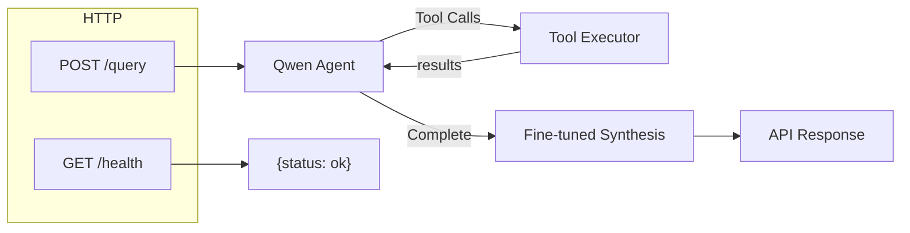
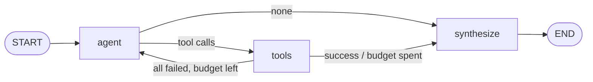
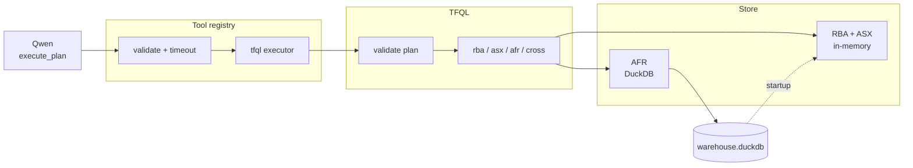

# Architecture

LangGraph financial Q&A agent. One HTTP question → grounded answer over RBA / ASX / AFR data.

Run guide: [HOW_TO_RUN.md](HOW_TO_RUN.md) · Data ingest: `src/data/README.md` · TFQL ops: `src/tfql/README.md`

---

## Overall flow

| Step | What happens |
|---|---|
| **GET /health** | Readiness gate. Returns 503 while the warehouse warms; 200 when ready. |
| **POST /query** | Entry point for a question. |
| **Qwen Agent** (`agent-brain`) | Plans and emits `execute_plan` tool calls. Does **not** write the final answer. |
| **Tool Executor** | Validates and runs tools against DuckDB. Results flow back to the agent. |
| **Fine-tuned Synthesis** (`domain-ft`) | Writes the user-facing answer from verified tool results. |
| **API Response** | `{ answer, steps, tool_trace }` |

Every number in the answer comes from a tool result. The synthesiser copies values — it never recomputes them.

---

## LangGraph workflow

Built in `src/graph/` — three nodes, one shared state.

- **agent** — one Qwen turn; recovers XML / bare-op tool-call quirks; enforces `MAX_AGENT_STEPS`.
- **tools** — runs pending calls in parallel via the registry; records `tool_trace`.
- **synthesize** — one `domain-ft` turn from question + tool results.

After a successful tool result, the graph goes straight to synthesis (a second planner turn often overflows the 4096-token context). No checkpointer — each `/query` is single-shot.

---

## Tool architecture

The planner sees **one tool**: `execute_plan`. It batches up to six typed operations (RBA / ASX / AFR / cross) in a single call, with `${other_id.data.field}` references between them.

**Registry guarantees** (`src/tools/registry.py`):

1. Args validated against a Pydantic schema before code runs
2. Per-call timeout
3. Failures return `{"error": ...}` — never crash the graph

**Data access:**

- **Startup** — RBA + ASX loaded into memory; `/health` stays 503 until warm
- **Request** — RBA/ASX are in-memory; only AFR hits DuckDB
- Store is immutable after startup → safe under concurrent requests

---

## Adding tools

### New agent tool (rare)

Copy `src/tools/placeholder.py` → e.g. `src/tools/my_tool.py`, then:

1. Define a Pydantic input model (becomes the planner's function schema)
2. Implement `async (input) -> ToolResult` — return errors as data, don't raise
3. Register via a `register_*` helper called from `register_all_tools()` in `src/tools/__init__.py`

Keep descriptions short and exact — they are prompt text. Each schema is re-sent every planner turn (context budget ~4096 tokens).

### New TFQL operation (usual)

Add a handler under `src/tfql/operations/` (`rba.py` / `asx.py` / `afr.py` / `cross.py`) with `@register`. The `execute_plan` catalogue picks it up automatically. See `src/tfql/README.md`.

---

## Module map

| Path | Role |
|---|---|
| `src/main.py` | FastAPI, startup, `/health` + `/query` |
| `src/config.py` | Settings from `config.yaml` + env |
| `src/graph/` | LangGraph state, nodes, wiring |
| `src/llm/client.py` | LiteLLM client (`brain_chat`, `synthesize`) |
| `src/tools/` | Registry, `execute_plan`, tool template |
| `src/tfql/` | Typed ops, validation, store, DuckDB |
| `src/eval/run_questions.py` | Offline eval harness |

---

## Latency notes

60s budget · ≥3 concurrent requests.

- Qwen thinking **off** (83s → ~5s on the same plan)
- One batched `execute_plan` call instead of multi-turn tool spam
- Async everywhere; TFQL work offloaded with `asyncio.to_thread`
- Tool messages stripped/truncated; brain max 256 tokens, synthesis 512
- Warehouse warmed before `/health` returns 200
