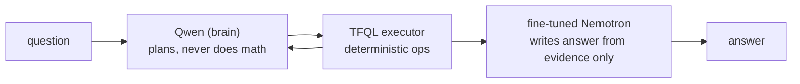

# Wombots — TL;DR

Agent that answers hidden financial questions over RBA/ASX/AFR data. Graded on fine-tune quality (30%), architecture (30%), and hidden-question correctness (40%, with a **60s hard cutoff** and **≥3 concurrent requests**).

- **TFQL** — a closed catalogue of typed ops (`rba.*`, `asx.*`, `afr.*`, `cross.*`). All arithmetic happens here, never in an LLM, so answers are exact.
- **Data** → `data set/` → `warehouse.duckdb` → `generate_training_data.py` runs real TFQL calls to produce grounded fine-tune examples (never invented).
- **Fine-tuning** — LoRA on Nemotron via an 8-stage pipeline (ingest → curate → render → train → predict → evaluate → select → export), then merged and served.
- **Biggest win** — disabling Qwen's reasoning tokens: 15× faster planning, identical plans.

Full detail: [ARCHITECTURE.md](ARCHITECTURE.md).
