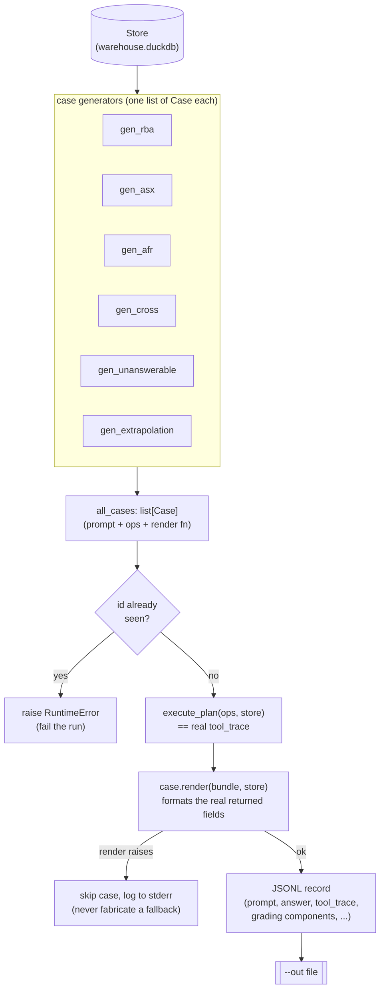

# Data Handling and Format

## Scripts

Scripts live directly in this directory (`src/data/`, no nested `scripts/` folder) and use paths relative to the current working directory (not the script's location) for their defaults, so run them from here, e.g. `python3 setup_duckdb.py`.

Pipeline order: `../../data set/` (raw, at the repo root — two levels up from `src/data/`; note the space in the name, so quote it) → `normalize_dates.py` → `normalized/` (ISO dates) → `setup_duckdb.py` → `parquet/` + `warehouse.duckdb`. From there, `generate_training_data.py` drives the warehouse through `src.tfql`'s real executor to produce fine-tuning JSONL.

```mermaid
flowchart LR
    raw["../../data set/\n(AFR, ASX, RBA Rates)"] --> norm[normalize_dates.py]
    norm --> normalized["normalized/\n(ISO dates)"]
    normalized --> duck[setup_duckdb.py]
    duck --> parquet["parquet/"]
    duck --> wh[("warehouse.duckdb")]
    wh --> test[test_queries.py]
    wh --> qt[query_tools.py]
    wh --> gen[generate_training_data.py\nTakes the public_questions.json]
    gen -->|"src.tfql.execute_plan\n(real ops, real answers)"| jsonl1["training/data/\ngenerated_questions.jsonl"]
    gen -->|"src.tfql.execute_plan\n(real ops, real answers)"| jsonl2["training/data/\ngenerated_questions_large.jsonl"]
```



### Quickstart

```
# From the root directory
pip install -r requirements.txt
python3 src/data/normalize_dates.py "./data set" ./normalized
python3 src/data/setup_duckdb.py ./normalized ./parquet ./warehouse.duckdb
# Test
python3 src/data/test_queries.py ./warehouse.duckdb
```

### Source data: `../../data set/`

The approved raw dataset (tracked in git, unlike everything this pipeline derives from it) has three subfolders, each with its own quirks the pipeline accounts for:

- **`AFR/`** — 85 `AFR_<start>-<end>.jsonl` files, one JSON object per article. Keys are **upper-case** (`HEADLINE`, `SUBHEAD`, `INTRO`, `TEXT`, `NEWSPAPER`, `PUBLICATIONDATE`); `setup_duckdb.py` re-aliases them to lower-case on ingest so `afr_articles` matches the other tables. `PUBLICATIONDATE` is `YYYYMMDD`. 92 of ~219.5k articles (across 4 files) have an empty `PUBLICATIONDATE` — those rows are dropped during ingest rather than failing the load (same defensive pattern as the ASX `volume` handling below).
- **`ASX/`** — 18 `<Company>-ASX-2015-2021.jsonl` files, one per company, already lower-case (`ticker`/`date`/`open`/`high`/`low`/`close`/`volume`) with `ticker` already stamped on every record — `csv_to_jsonl.py --ticker` isn't needed for this data.
- **`RBA Rates/`** — `RBA-rates.csv` and an equivalent `.jsonl` (the `.jsonl` has a UTF-8 BOM on its first line; `normalize_dates.py` handles it). Columns: `Effective Date` (`D Mon YYYY`), `Change % points`, `Cash rate target%` — note no space before the `%`.

### csv_to_jsonl.py

Converts a single CSV file to JSONL, one JSON object per row. Values are auto-typed (int/float where possible, string otherwise).

```
python3 csv_to_jsonl.py input.csv [output.jsonl] [--ticker BHP.AX]
```

- `output.jsonl` defaults to the input filename with a `.jsonl` extension.
- `--ticker` stamps a `ticker` field onto every record (used for the ASX company files).

### normalize_dates.py

Walks a directory tree and rewrites any CSV column / JSONL key whose name contains `date` (case-insensitive) into ISO `YYYY-MM-DD` format. Source formats handled: `D Mon YYYY` (e.g. RBA's `3 Feb 2010`), `YYYYMMDD` (e.g. AFR's `20150131`), already-ISO, plus a couple of common fallbacks.

```
python3 normalize_dates.py [input_dir] [output_dir]
```

- Defaults: `input_dir=.`, `output_dir=./normalized` — for the real dataset, pass `input_dir` explicitly (it's `../../data set`, not `.`).
- Processes one file at a time; mirrors the input directory's structure under `output_dir`; never modifies `input_dir`.
- Any value that doesn't match a known format is left as-is and logged to stderr as a warning rather than failing the run.

### setup_duckdb.py

Ingests the normalized datasets into Parquet (Hive-partitioned) and loads that into DuckDB tables — this is what backs the fast querying. Partitioning (`ticker` for ASX, `year`/`month` for AFR) is what keeps queries fast as file counts grow (18 ASX companies, up to 200k AFR files).

```
python3 setup_duckdb.py [source_dir] [parquet_dir] [db_path]
```

- Defaults: `source_dir=./normalized`, `parquet_dir=./parquet`, `db_path=./warehouse.duckdb`.
- Produces three tables: `rba_rates`, `asx_prices`, `afr_articles`.
- Idempotent — every step uses `CREATE OR REPLACE` / overwrite, so re-running after new source files land rebuilds cleanly with no manual cleanup.
- `volume` is defensively `TRY_CAST` to `NULL` rather than `CAST` (a corrupted value in an earlier version of the BHP data motivated this; the current `data set/` has none, but future source files could).
- Also builds a DuckDB FTS (full-text search) index on `afr_articles` (`headline`/`subhead`/`text`, schema `fts_main_afr_articles`), rebuilt with `overwrite=1` every run since the table itself is rebuilt every run.
- Ends by opening 3 concurrent read-only connections against the resulting database to confirm parallel reads work.

Requires `duckdb` (see `requirements.txt`): `pip install -r requirements.txt`.

### test_queries.py

Smoke-tests `warehouse.duckdb` by re-deriving known-correct facts via SQL (lowest RBA rate, longest non-zero rate gap, the 2022-2023 tightening cycle, BHP's high/low and biggest single-day move, AFR article counts and mentions, etc.) and asserting they match values independently derived from `data set/`. Also verifies 3 concurrent read-only connections succeed.

```
python3 test_queries.py [db_path]
```

- Default: `db_path=./warehouse.duckdb`.
- Prints `PASS`/`FAIL` per check; exits `0` if everything passes, `1` otherwise — catches regressions in the ingestion pipeline (bad date parse, dropped rows, reintroduced data corruption), not just "did it crash".

### query_tools.py

A library of generic, schema-validated query functions over `warehouse.duckdb`, meant to be wrapped as tools for an agentic system to call directly (plain arguments in, JSON-serializable data out — no DuckDB objects). Table/column names are checked against `information_schema` before use and filter values are always bound parameters, since these functions may end up driven by an LLM rather than a trusted caller.

```
python3 query_tools.py [db_path]   # runs a demo of every function
```

See [TOOLS.md](TOOLS.md) for the full catalog of functions, arguments, and examples.

### generate_training_data.py

Generates fine-tuning training examples (question, grounded answer, `tool_trace`) at scale by
actually running `src.tfql`'s `execute_plan` against `warehouse.duckdb` — the same executor and
operation registry the production agent uses — instead of asking a model to invent facts or
tool traces. Every answer is a template rendered from real computed values; every `tool_trace`
entry is a real `execute_plan` call and its real result, including real `TFQLError`s where a
question intentionally falls outside the data. No question is ever asked without also running
its plan, so a wrong number can only come from a bug in an operation already covered by
`src/tests/` — never from a model guessing.

```
# From the root directory, after building warehouse.duckdb (see Quickstart above)
python3 -m src.data.generate_training_data --warehouse ./warehouse.duckdb --out training/data/generated_questions.jsonl
```

Run as a module (`-m`), not a script, so `src.tfql` resolves as a package.

#### How a record is built



Each `Case` names one of three `category` values:

- **answerable** — single- and cross-dataset questions across RBA, ASX and AFR the data supports.
- **unanswerable** — coverage gaps, unknown tickers, out-of-range dates. The underlying operation
  is actually called and actually fails (`DATE_OUTSIDE_COVERAGE`, `UNKNOWN_TICKER`,
  `NO_MATCHING_RECORDS`); the answer states the refusal using the real coverage bounds read from
  the store, not a guessed cutoff.
- **extrapolation** — prediction/forecast framing (future rates, future prices, "will X happen").
  The answer grounds itself in the last real observation the data contains, then explicitly
  declines to invent a forecast, per the challenge brief's rule against inventing figures.

Two derived grouping keys ride along on every record, both used by
`training/ft-pipeline/` to avoid near-duplicate templates leaking across a train/val/test split:

- `template_family` — the id's first three hyphen-separated tokens (e.g. `GEN-ASX-return-BHP.AX-2018`
  and `GEN-ASX-return-CBA.AX-2021` both collapse to `GEN-ASX-return`).
- `question_type` — the actual TFQL op(s) invoked (e.g. `asx.max_drawdown`, or `+`-joined for the
  multi-op cross-dataset cases), a finer-grained cut than `template_family` since the id also
  encodes dataset and naming choices.

#### Existing outputs in `training/data/`

Two generated files are already checked in, from two different sizes of run against the same
generator:

| file | records | category (answerable / unanswerable / extrapolation) | difficulty (easy / medium / hard) | scope (single / cross) | template families | question types |
|---|---|---|---|---|---|---|
| `generated_questions.jsonl` | 126 | 106 / 10 / 10 | 55 / 46 / 25 | 111 / 15 | 29 | 20 |
| `generated_questions_large.jsonl` | 939 | 797 / 71 / 71 | 555 / 281 / 103 | 860 / 79 | 32 | 22 |

`generated_questions_large.jsonl` is the current generator's output — it reflects the fuller set
of window/ticker/date variations in the templates above (e.g. multiple RBA rate-extreme windows,
a rank/volume comparison per year per ticker group). `generated_questions.jsonl` is a smaller,
earlier snapshot with the same schema and categories but fewer window variations per template,
kept as a lighter-weight sample. Counts drift as templates are added or expanded, so treat this
table as a snapshot too — regenerate and read the script's stderr summary (it prints `category`,
`difficulty`, and `scope` breakdowns on every run) rather than trusting either file as current
forever.

Output record schema, the `training/ft-pipeline/` config that consumes these files, and a
worked example record: [training/data/README.md](../../training/data/README.md).

## Data Curation Process

This section documents how the original example/mock dataset (used to shape the schema and mock questions below) was generated, before the approved `data set/` — the real dataset the pipeline now ingests — was added.

1. Based on data examples in Hackathon docs we generated extended version of the example data with the prompt:
   - "Given the example data provided, generate a [x] plausible records"
2. Generated script to convert CSV files to JSONL
3. Generated example questions based on sample questions provided in the hackathon docks:
   - "Based on the data available in this directory, generate some mock questions and expected answer elements in JSON format. [Example Questions]"
4. Generated additional data files for more companies and dates.
   - "Generate new iterations of the BHP ASX data for more companies"
5. Generated script to normalise dates in the dataset to the YEAR-MONTH-DAY ISO format.

## Database Setup

- Unify date range for ease of parsing data (potential to join if necessary)
- Selected duck.db for data storage as it provides high speed read from files. Files are ingested into paraquet format to speed up query times.
- Use Duckdb FTS for ranked full text search.
- Identified useful general purpose tool calls to parse the data with minimal need for the brain to produce a query.
- Included fallback query tool.
- Populated mock questions with tools and query results.
- Generated additional mock questions that make use of the tools:
  - Add tools that are useful for each mock question to a tools list in each question.
  - Generate some more questions that might need multiple tool calls.
