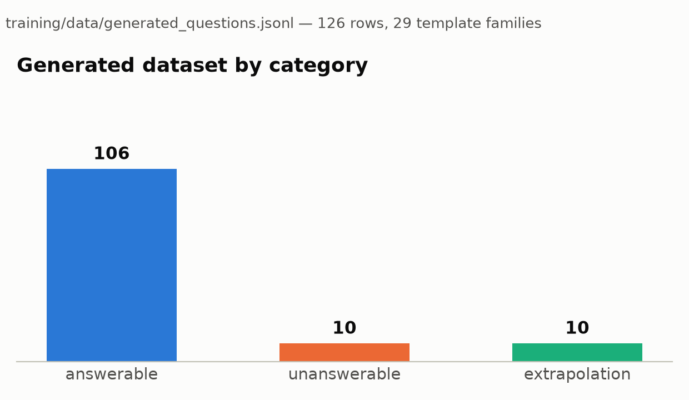
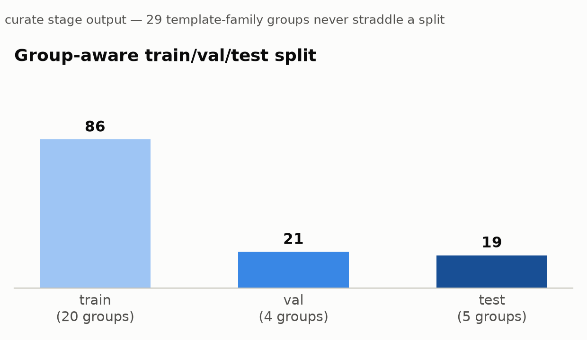
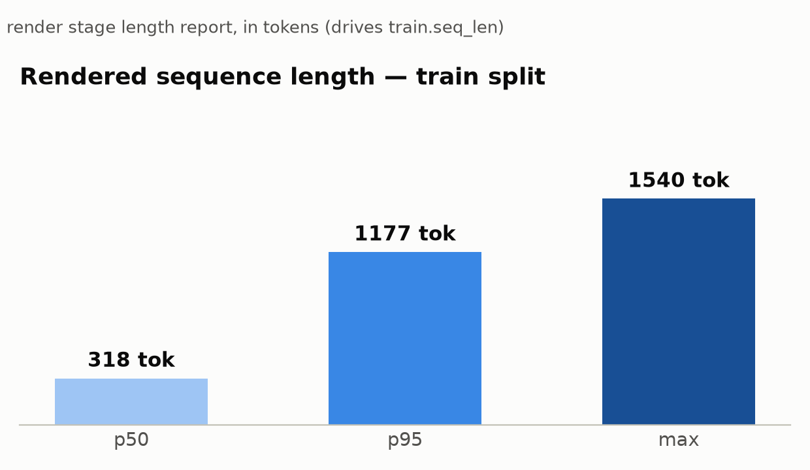

# ft-pipeline

Fine-tunes the hackathon model (`nvidia/Llama-3.1-Nemotron-Nano-8B-v1`) with **LoRA**
on the finance-agent's own generated Q&A/tool-trace data, then hands the winning
checkpoint off to be merged and served. This README explains what the pipeline does
end to end, what's actually been run so far, and how to run it yourself.

Method is **LoRA** — the base model's weights are frozen and a small adapter
(tens of MB) is trained alongside them. The pipeline itself is staged and
**contract-agnostic**: it's built so the parts we _have_ decided (LoRA,
checkpoint selection, splitting, evidence) can be built and tested **before**
the parts we haven't (tool-result schema, prompt format, grading contract,
serving system prompt).

## The end-to-end picture

```mermaid
flowchart LR
    subgraph DATA["training/data — see generate_training_data.py"]
        A["data set/ (RBA, ASX, AFR)"] --> B[warehouse.duckdb]
        B --> C["generate_training_data.py\n(runs the real TFQL executor)"]
        C --> D[generated_questions.jsonl]
    end

    subgraph PIPE["ft-pipeline — this directory, the eight stages"]
        D --> E[ingest]
        E --> F[curate]
        F --> G[render]
        G --> H[train]
        H --> I[predict]
        I --> J[evaluate]
        J --> K[select]
        K --> L[export]
    end

    subgraph SERVE["scripts/ — bring the winner online"]
        L --> M["merge-adapter.sh\n(fold LoRA into base, CPU)"]
        M --> N["run-vllm.sh\n(serve merged model, GPU)"]
        N --> O["agent -> submission.json"]
    end
```



Nothing here is invented or hand-labelled: `generate_training_data.py` answers
every training question by actually calling `src.tfql`'s `execute_plan` against
`warehouse.duckdb` — the same executor and operations the production agent
uses — so a wrong number in the training data would mean a bug in an operation
already covered by `src/tests/`, not a model or a human guessing. See
[`training/data/README.md`](../data/README.md) for how that corpus is built.

## The data

[`training/data/generated_questions.jsonl`](../data/generated_questions.jsonl) is
what `config/generated.yaml` (the config for the real fine-tune) trains on: 126
rows across 29 template families, split into three categories — the model has to
learn to answer, to refuse when the data doesn't cover the question, and to
decline forecasts rather than invent them:



A much larger corpus, [`generated_questions_large.jsonl`](../data/generated_questions_large.jsonl)
(939 rows, 32 template families), landed most recently and is not yet wired into
any config — `config/generated.yaml` still points at the 126-row file, whose
field map it's settled against. Swapping to the larger file only needs
`adapter.path` updated once its field names are confirmed to match.

`curate` never lets a template family straddle train/val/test — generated data is
full of near-duplicates (same template, different ticker/date), and letting one
leak across the split would make the val score fiction:



## The eight stages

| stage      | in → out                                    | decides                       |
| ---------- | ------------------------------------------- | ----------------------------- |
| `ingest`   | raw → `canonical.jsonl`                     | which source adapter          |
| `curate`   | canonical → `train/val/test`                | dedupe, **group-aware** split |
| `render`   | canonical → messages + **length report**    | prompt format, seq-len budget |
| `train`    | messages → LoRA checkpoints                 | backend, hyperparameters      |
| `predict`  | base **and** every checkpoint → predictions | decoding                      |
| `evaluate` | predictions × graders → metrics             | what "good" means             |
| `select`   | metrics → chosen checkpoint + rationale     | shipping policy               |
| `export`   | → evidence bundle                           | packaging                     |

Every stage is file-in / file-out, so any stage can be re-run alone. `predict`
(slow, GPU) is split from `evaluate` (fast, CPU) on purpose: grader definitions
change often, and re-grading stored predictions costs seconds.

`render` also measures real token length with the actual model tokenizer, which
sets `train.seq_len` rather than leaving it guessed (that's exactly where OOM
risk lives):



### Where the committed `runs/generated/` bundle currently stands

`runs/generated/` (committed, since it's small enough to review) has been
carried through `ingest → curate → render → predict`, the last of those against
the **base** model only — i.e. it proves the whole plumbing and gives a
before-fine-tuning reference, but `train`/`evaluate`/`select`/`export` haven't
been run against this data yet (`runs/generated/train/` is empty, and is
git-ignored regardless — checkpoints don't belong in git).

Separately, `config/nemotron.yaml` — same pipeline, pointed at the base model
family via 200 synthetic **stub** records instead of real data — has been run
for real, to shake out the GPU training path end to end. `checkpoint-100` from
that run is what `scripts/merge-adapter.sh` merges by default, and what's
currently served as `nemotron-8b-finance-merged` in [`submission.json`](../../submission.json).
So the model behind the current submission has been proven through a real LoRA
training loop on the actual hackathon model — the next step is pointing that
same `train` stage at `config/generated.yaml`'s real, grounded data instead of
the stub records.

## From checkpoint to a served model

A LoRA checkpoint is an adapter, not a servable model — it has no base weights
of its own. Two scripts in [`../../scripts/`](../../scripts/README.md) take a
`select`ed checkpoint the rest of the way:

1. **`merge-adapter.sh`** folds the adapter into the base model (CPU-only,
   ~10 min, runs inside `nvcr.io/nvidia/nemo:25.09` since the host has no
   torch), producing a standalone model directory.
2. **`run-vllm.sh`** serves that merged directory as an OpenAI-compatible
   endpoint in Docker (`vllm-ft`, port 8001).

Merging (rather than vLLM's `--enable-lora`) is required here specifically
because the checkpoints set `use_dora=true`, which vLLM's runtime LoRA path
rejects outright. The served endpoint and model name are exactly what
[`submission.json`](../../submission.json) points the agent at — see
`scripts/README.md` for the full quickstart and every configuration knob.

## Setup

Needs conda (miniforge) and Python 3.12. **Run every command from
`training/ft-pipeline/`** — `--config`, `--overlay` and the adapter's `path` are
all resolved relative to the working directory.

```bash
cd training/ft-pipeline
conda create -n ft-pipeline python=3.12 -y
conda activate ft-pipeline      # every command below assumes this is active
```

**Activate the env rather than prefixing each command with `conda run`.**
`conda run` captures stdout and releases it only when the process exits, so a
training run prints nothing until it is over — no progress, no loss curve, no
sign of life. Activating gives you live output. Where activating is impossible
(scripts, cron, one-liners) either call the interpreter directly or pass
`--no-capture-output`:

```bash
~/miniforge3/envs/ft-pipeline/bin/python -m ftpipe.cli run --config config/generated.yaml
conda run --no-capture-output -n ft-pipeline python -m ftpipe.cli run --config config/generated.yaml
```

**Install `torch` first, from the CUDA index — before `requirements.txt`.** PyPI's
default `torch` wheel is not the build you want here; installing it first from
the matching CUDA index is what pins the GPU build, and every later install then
sees the requirement as already satisfied and leaves it alone.

```bash
nvidia-smi | grep "CUDA Version"        # driver's CUDA version -> pick the index
pip install torch --index-url https://download.pytorch.org/whl/cu130
```

Match the index to the driver. This box is a GB10 on driver 580 / CUDA 13.0, so
`cu130` is the exact match and carries the newest wheels. `cu128` also works
here — a CUDA 12.8 wheel runs on a 13.0 driver, since drivers are backward
compatible with older CUDA runtimes — so use it if you are on a CUDA 12.8 driver
or want the more widely exercised build. Both indexes carry `cp312` wheels for
`aarch64` as well as `x86_64`, so the command is the same on either
architecture. Picking a too-old index is the usual cause of
`torch.cuda.is_available() == False` or an `sm_121 is not compatible` warning on
Blackwell.

Then the rest:

```bash
pip install -r requirements.txt
```

Confirm the GPU build took before going further — the version should carry a
`+cu` local tag, and the last value **must** be `True`:

```bash
python -c "import torch; print(torch.__version__, torch.version.cuda, torch.cuda.is_available())"
# e.g. 2.13.0+cu130 13.0 True    <- a bare "2.13.0" with no +cu means the wrong wheel
```

Only `pyyaml` is needed for the walking skeleton — all eight stages run on it
alone, so you can skip both torch steps until you want real training.
`transformers`/`peft`/`accelerate`/`datasets` are for `train.backend: peft` and
`predict`; the `rouge-score`/`sacrebleu`/`anthropic`/`openai` lines are for the
optional graders. If conda is unavailable, a plain `python3.12 -m venv .venv`
works identically, same torch-first ordering (`.venv/` is git-ignored).

Verify the install — no GPU, no data, no model download, a few seconds:

```bash
python tests/test_pipeline.py             # 20/20 passed
python -m ftpipe.cli plugins              # 2 adapters, 5 graders, 2 backends
python -m ftpipe.cli run --config config/skeleton.yaml
```

Both spellings of the entry point work — the subcommand (`run`, `stage`,
`plugins`) always comes _after_ the module or file path:

```bash
python -m ftpipe.cli run --config config/generated.yaml   # preferred
python ftpipe/cli.py   run --config config/generated.yaml   # equivalent
```

The skeleton should end in `✓ done` with a bundle under `runs/skeleton/`. Note
that **exit code 2 is not a crash** — it means `UndecidedError`, i.e. a config
key that is deliberately `null` (see _Undecided values are `null`_, below); the
CLI prints `⏸ undecided:` and the exact key name. Exit 1 is a real failure.

### Which config to start from

| config                  | needs                | use it for                                                 |
| ----------------------- | --------------------- | ----------------------------------------------------------- |
| `config/skeleton.yaml`  | nothing               | first run, and after any change — proves the plumbing      |
| `config/generated.yaml` | GPU + model download  | **the real fine-tune** — 126 generated Q/A/tool-trace rows |
| `config/nemotron.yaml`  | GPU + model download  | real LoRA on stub records — currently the source of the checkpoint that's actually merged & served |
| `config/mock.yaml`      | GPU + real data       | superseded by `generated.yaml` (see caveat)                 |

`config/generated.yaml` is the one to run for an actual fine-tune on real data.
It reads `../data/generated_questions.jsonl` (126 rows, 29 template families)
and its field map is settled against that file, so it needs no edits. Note two
things it had to work around, both worth re-checking if the data is
regenerated:

- **`eval_field` must be `required_facts`, not `grading`.** `grading.components`
  is a list of _objects_; `component_match` compares components as strings, so
  pointing at it scores `component_recall` 0.0 even for a word-perfect answer —
  which would tie every checkpoint at zero and make `select` meaningless.
  `required_facts` holds the same sentences as plain strings and scores gold 1.0.
- **`seed`/`splits` are chosen for category coverage.** At `[0.8, 0.1, 0.1]` the
  val split was 100% `answerable` — and no seed in 0..39 fixes that — so
  checkpoint selection could not see refusal or extrapolation behaviour at all.

`config/mock.yaml` points at `../../data/mock_questions.json`, which is **not
present in this repo**. Prefer `generated.yaml`; if you do want mock, update
`adapter.path` and the field map to match a file that exists.

### Environment variables

All optional:

| var                                    | effect                                                                                                                                           |
| --------------------------------------- | -------------------------------------------------------------------------------------------------------------------------------------------------|
| `FTPIPE_RUNS`                          | where run directories go (default `./runs`, git-ignored)                                                                                         |
| `CUDA_VISIBLE_DEVICES`                 | pin the GPU. Must be an index `nvidia-smi` lists — an out-of-range index hides all GPUs and `train` dies with a misleading `bf16/gpu` ValueError |
| `HF_HOME`                              | Hugging Face cache location — worth setting if `$HOME` is small (~6 GB for the 3B stand-in, ~16 GB for Nemotron)                                 |
| `ANTHROPIC_API_KEY` / `OPENAI_API_KEY` | only read by the opt-in `llm_judge` grader                                                                                                       |

Both models are ungated, so no `huggingface-cli login` step is required.

## Quick start

```bash
python -m ftpipe.cli plugins                       # what's pluggable
python -m ftpipe.cli run --config config/skeleton.yaml   # no GPU, no data
CUDA_VISIBLE_DEVICES=0 python -m ftpipe.cli run --config config/nemotron.yaml  # real LoRA
```

The device index must be one `nvidia-smi` actually lists (this box has only
`0`). Naming a device that does not exist hides _every_ GPU, and `train` then
fails with `ValueError: Your setup doesn't support bf16/gpu` — `bf16=True` is
unconditional in `backends.py`, so "no visible GPU" surfaces as a dtype
complaint rather than an obvious "GPU not found".

### Two GPU errors that do not say "out of memory"

Both really mean _the model does not fit_, so check free VRAM first —
`nvidia-smi` reports total usage, but only torch's own view tells you what is
still allocatable:

```bash
python -c "import torch;f,t=torch.cuda.mem_get_info(0);print(f'{f/2**30:.1f} GiB free of {t/2**30:.1f}')"
```

- `RuntimeError: Tensor on device cuda:0 is not on the expected device meta!` —
  raised at step 0 with `train.device_map: auto`. `auto` shards a model that does
  not fit, and when it runs out of room it leaves layers on the `meta` device
  (unmaterialised) instead of erroring. Use `device_map: {"": 0}` for
  single-GPU training so an unfittable model raises a normal CUDA OOM.
- `ValueError: Your setup doesn't support bf16/gpu` — no GPU is visible at all;
  see the `CUDA_VISIBLE_DEVICES` note above.

Re-run one stage only (e.g. after changing a grader — no regeneration needed):

```bash
python -m ftpipe.cli stage evaluate select --config config/nemotron.yaml
```

Tests (no pytest needed) — includes the **contract-change drill**, which fails
if knowledge of the prompt format ever leaks outside `renderers/`:

```bash
python tests/test_pipeline.py    # 20/20
```

## The canonical record

The one shape everything agrees on. `inputs` and `eval` are **opaque dicts** —
that is where all the undecided contract detail hides:

```python
{"id", "task", "target",          # committed structure
 "inputs": {...},                 # renderer is the only reader
 "eval":   {...},                 # grader is the only reader
 "meta":   {...}}                 # provenance + group_key
```

When the schema lands, you write one adapter and one renderer. Curate, train,
predict, select and export never change.

## Three deliberate design choices

**One prompt builder.** `renderers/chat.py::build_messages` builds both training
text and live requests (`serving_payload`). Train/serve prompt skew is the most
common silent cause of "trained fine, worse in production"; sharing the builder
makes it structurally impossible rather than a discipline problem.

**Group-aware splitting.** `curate` splits on `meta.group_key`, never on rows.
Generated data is full of near-duplicates; letting a template straddle
train/val produces a val score that is fiction.

**Guardrailed selection.** `select` maximises a primary metric _subject to_
guardrails, so a checkpoint that scores higher while inventing numbers
(`hallucinated_number_rate`) cannot win. It also prefers the earliest
checkpoint within a tie tolerance.

## Undecided values are `null`, not defaults

`config.require()` raises `UndecidedError` naming the exact key instead of
guessing. `train.seq_len` is deliberately strict — it must come from the
measured p95 in `render`'s length report, because guessing it is where the OOM
risk lives.

## Models

`train.model_id` is the only line that changes:

- `nvidia/Llama-3.1-Nemotron-Nano-8B-v1` — the hackathon model (ungated),
  ~16 GB bf16. **What `config/nemotron.yaml` and `config/generated.yaml` now use.**
  Needs a mostly-free GPU.
- `unsloth/Llama-3.2-3B-Instruct` — same Llama-3 architecture and chat template
  as the hackathon target, ~6 GB bf16, fits beside other jobs. Use for iteration.

Swapping between them needs no other change — but check free VRAM first, since
this GPU is shared with whatever else is running:

```bash
nvidia-smi --query-gpu=memory.used,memory.total --format=csv
# or, for what torch can actually still allocate:
python -c "import torch;f,t=torch.cuda.mem_get_info(0);print(f'{f/2**30:.1f} GiB free')"
```

## LoRA/DoRA/rsLoRA/NEFTune, and the eval fallback chain

`backends.py`'s `peft` backend and the graders are kept as config rather than
hardcoded:

- `train.lora.use_dora` / `use_rslora` — DoRA (Liu et al. 2024) and rsLoRA
  (Kalajdzievski 2023), both `true` in `config/nemotron.yaml` and
  `config/generated.yaml`.
- `train.optim.neftune_noise_alpha` — NEFTune (Jain et al. 2023) embedding
  noise, training-only, `null` disables it.
- `train.loss` (`ftpipe/losses.py`) — named, swappable loss.
  `config/generated.yaml` sets `fact_token_weight: 1.5`, upweighting tokens
  that contain a digit — the numbers/dates `component_match` and the
  challenge's own judge actually grade — by 50% relative to prose tokens.
- `evaluate.graders` includes **`reference_overlap`** (token-F1 always;
  ROUGE-L/BLEU too if `rouge-score`/`sacrebleu` are installed) — the fallback
  that still scores something once `eval.components` is missing, since
  `component_match` already scores `{}` (excluded from the mean) when there
  are no components.
- **`llm_judge`** — groundedness/correctness/concision via Anthropic or
  OpenAI, one call per prediction. Not in every default `graders` list (costs
  network + an API key); opt in with:
  ```yaml
  evaluate:
    graders: [component_match, format_health, llm_judge]
    llm_judge: { provider: anthropic, model: claude-sonnet-5 }
  ```
  and set `ANTHROPIC_API_KEY` (or `OPENAI_API_KEY` for `provider: openai`).

## Layout

```
ftpipe/
  schema.py      canonical record + validation
  registry.py    name -> implementation
  config.py      YAML + null-means-undecided
  artifacts.py   run dirs, manifests, provenance
  backends.py    noop | peft (LoRA lives here)
  adapters/      raw -> canonical      [swap when schema lands]
  renderers/     canonical -> prompt   [swap when contract lands]
  graders/       component_match, format_health, exact_match, reference_overlap, llm_judge
  policies/      checkpoint selection
  stages/        the eight steps
config/          skeleton.yaml, generated.yaml, nemotron.yaml, mock.yaml
docs/images/     charts embedded in this README, regenerate from runs/generated/*
runs/<run_id>/   artifacts + manifests (checkpoints git-ignored, everything else committed)
```

## Relationship to other work

Separate from `cognitivo_prep/training/finetune_nemotron.ipynb`, which does the
same job monolithically. This is the staged version; it can be moved under
`TeamSubmission/training/` unchanged when that repo is assembled.
